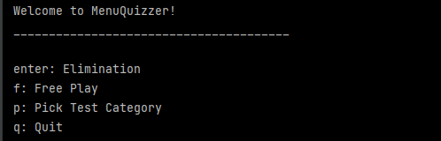
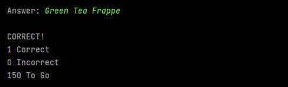
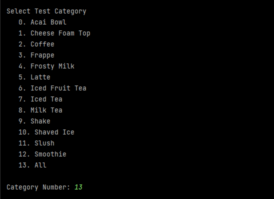
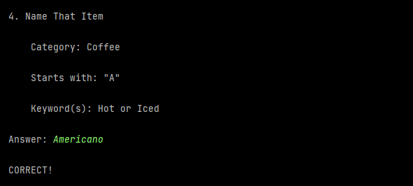
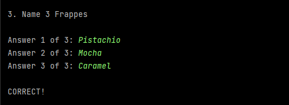
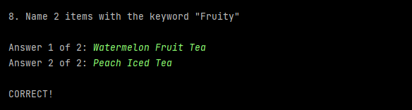
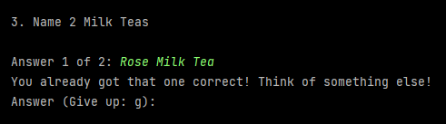
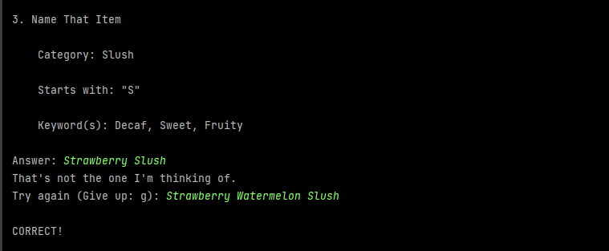
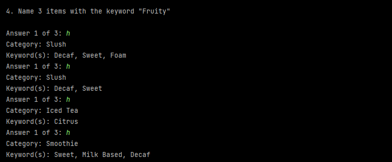

Introducing: MenuQuizzer! The best way to learn the Boba Time Menu! 

## Setup
___
1. Install Java
2. Download and unzip the zip file
3. Run QuizDriver.java

## Main Menu
___

The game starts at the main menu:

Here, the user can choose between one of the two game modes:

Elimination
* Users test their knowledge of the menu and work to earn a score.
* After every question, the user is shown the stats:

  
  
* The game is finished when they have correctly identified each item on the menu one time each. Then, they are given a 
  score. 
* Once a user correctly identifies an item, it is eliminated from the list of possible correct answers, hence the name
  “elimination.”
  
Free Play:
* MenuQuizzer asks questions forever until the user wishes to quit.

By default, the user will be quizzed on the entire menu. If the user wants to focus on a particular item category, the 
user can change the test to only involve a particular category.

## Questions
___
Once the game begins, a question will be randomly generated. There are three types of questions:

Name That Item:

Category Question:

Keyword Question:

## Tips
___
Once you have "eliminated" an item, don't give it as an answer again! MenuQuizzer will remember!

Sometimes during 'Name That Item,' your guess may fit the prompt, but MenuQuizzer may have another item in mind:

Many questions have multiple possible answers. If the first hint doesn't work, ask for another! There may be multiple 
hints avaliable! You won't get the same hint twice, though!

## Contributing
___

Because this is only a personal side project, MenuQuizzer is not open to contributors.

## Support
___
Any questions? Email me at anthonyleedebem@gmail.com
